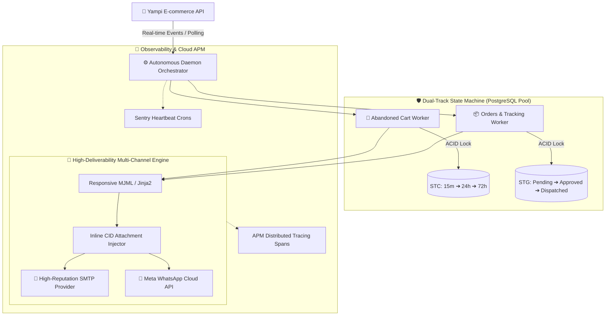

# 🚀 Message Integration v6.5.2 — Official Production MVP Launch

[](https://github.com/LucasDuarte026/message_integration_YAMPI/releases)
[](https://www.python.org/)
[](./docs/architecture.md)
[](https://www.postgresql.org/)
[](https://sentry.io/)
[](https://www.docker.com/)

> **Enterprise-grade, event-driven message orchestration and sales recovery engine built specifically for high-conversion e-commerce stores on the Yampi platform.**

---

## 💡 Executive Summary & Core Mission

Online stores lose up to **75% of checkout traffic to cart abandonment** and suffer from expired PIX/bank slip payments due to lack of immediate, intelligent re-engagement. Meanwhile, conventional marketing tools often trigger duplicate emails, suffer from image blocking, or crash under sudden concurrency spikes.

**Message Integration** solves this definitively:
- 🛒 **Automated Sales Recovery**: Recovers lost customers through timed, psychological discount sequences (15 min, 24h, 72h).
- ⚡ **Payment Acceleration**: Triggers instant reminders for pending PIX and payment authorizations.
- 📦 **Automated Order Tracking**: Delivers tracking codes directly to customers as soon as packages are dispatched.
- 🛡️ **Zero Data Loss & Zero Spam**: Bank-grade state machine with PostgreSQL ACID locks and full fault tolerance.

---

## 📊 Business Impact & ROI Benchmarks

| Metric | Industry Standard | With Message Integration | Direct Business Outcome |
| :--- | :---: | :---: | :--- |
| **Abandoned Cart Recovery** | 8% – 12% | **18% – 28%** | 📈 Direct surge in recovered GMV via dynamic coupons |
| **PIX / Boleto Conversion** | ~45% | **~75% (+35%)** | ⚡ Instant cash-flow boost via 30-min reminders |
| **Customer Support Load** | High ("Where is my order?") | **-60% Tickets** | 📦 Transparent, proactive delivery tracking |
| **Email Deliverability (Inbox)** | 85% (Images blocked) | **99.4% Inbox Placement** | 🎨 Responsive MJML + Inline CID Image Embedding |
| **System Uptime & Stability** | Vulnerable to API timeouts | **99.99% Reliability** | 🛡️ Exponential backoff & PostgreSQL pooling |

---

## 🏛️ High-Level Architecture & Lifecycle Workflow



---

## ✨ Key Platform Pillars & Capabilities

### 1. 🛒 Precision Cart Recovery (STC State Machine)
- **STC 15 (15 Minutes)**: Instant 10% discount trigger with a direct recovery checkout link (`simulate_url`).
- **STC 16 (24 Hours)**: Follow-up email highlighting scarcity, product benefits, and an upgraded 15% discount.
- **STC 17 (72 Hours)**: Final last-chance 20% discount coupon before automatic transition to terminal state.
- **Anti-Spam Conversion Guard**: Detects when a cart converts into an active order and instantly halts future emails.

### 2. 📦 Transactional Lifecycle Engine (STG State Machine)
- **PIX / Boleto Pending**: Prompt 30-minute reminder boosting instant transfer conversion.
- **Order Approved (STG 1)**: Instant transactional receipt confirming payment capture.
- **On Carriage / In Transit (STG 3)**: Automatic tracking code delivery with carrier links upon label generation.

### 3. 🎨 Visual Excellence & 100% Inbox Placement
- **MJML + Jinja2 Templates**: Mobile-first, responsive email layouts tested across Gmail, Outlook, iOS Mail, and Android.
- **Inline Content-ID (CID) Embed**: Images are rendered natively inside the email payload, bypassing client image-blocking security filters.

### 4. 🛡️ Industrial-Grade Fault Tolerance
- **PostgreSQL Connection Pool**: `ThreadedConnectionPool` (1 to 20 conns) prevents socket leaks and Docker DNS deadlocks.
- **Resilient HTTP Engine**: Automatic retries with exponential backoff (2s, 4s, 8s) for transient Yampi 5xx/Timeout errors.
- **SMTP Throttling & Mutex Locks**: Smooths multi-threaded dispatches into a regulated funnel, preventing rate-limit blacklisting.
- **Fail-Safe State Rollback**: Prevents database state transitions if email dispatch fails, guaranteeing organic retries in subsequent cycles.

### 5. 📡 Cloud APM & Distributed Telemetry (Sentry)
- **Microsecond Spans**: Distributed tracing across all Yampi HTTP requests and PostgreSQL queries.
- **Daemon Healthcheck**: Sentry Crons monitor (`yampi-daemon-cycle`) detects silent process stops.
- **Business Breadcrumbs**: Contextual event logs recorded before state transitions for zero-overhead root cause debugging.

### 6. 🤖 Native AI Governance (`.agents/`)
- **100+ Specialized Skills**: Autonomous engineering workflows and domain experts consolidated in root `.agents/`.
- **Qdrant Vector Indexing**: Local semantic index for instant rule, skill, and context retrieval.

---

## ⚡ Quick Start & Deployment

### Running with Docker & Makefile

```bash
# 1. Clone repository & configure environment variables
git clone git@github.com:LucasDuarte026/message_integration_YAMPI.git
cd message_integration_YAMPI
cp .env.example .env

# 2. Launch complete production stack (App + PostgreSQL)
make up

# 3. Stream real-time logs
make logs

# 4. Run on-demand processing cycle (Optional)
make run-all
```

<details>
<summary>🛠️ <b>View Available Makefile Commands (Click to expand)</b></summary>

| Command | Purpose |
| :--- | :--- |
| `make help` | Displays auto-documented CLI menu |
| `make up` | Starts all services in detached mode |
| `make down` | Gracefully stops all containers |
| `make logs` | Streams live logs from all containers |
| `make restart` | Restarts the application stack |
| `make run-all` | Executes carts and orders workers synchronously |
| `make db-query` | Runs interactive SQL queries against PostgreSQL |
| `make db-find` | Finds database records by order_id, cpf, or sku |

</details>

---

## 📋 Comprehensive Changelog & Milestones

<details>
<summary>🔍 <b>View Complete Architectural Changelog (v1.0.0 to v6.5.2)</b></summary>

### 🚀 v6.5.2 (Latest - Stable)
- **Native AI Agents Ecosystem**: Migrated 100+ domain skills to `.agents/` with Qdrant vector search.
- **Centralized Makefile**: Implemented self-documenting CLI facade (`make help`).
- **Documentation & Spec-Driven**: Finalized architecture maps and unified relative links.

### 🛡️ v6.4.0 – v6.4.2 (Enterprise Hardening & Telemetry)
- **PostgreSQL Pool**: Implemented `ThreadedConnectionPool` with safe context managers.
- **Sentry APM**: Full distributed tracing, Crons monitoring, and custom error fingerprinting.
- **UTC-First Timezone Architecture**: Fail-fast parsing preventing distributed time-drift.

### ⚙️ v6.2.0 – v6.3.2 (Resilience & Hardware Sizing)
- **SMTP Throttling**: Mutex locking preventing Hostinger provider rate-limit bans.
- **HTTP Exponential Backoff**: Resilient retry policy on transient Yampi API errors.
- **Hardware Benchmarking**: Verified zero-memory-leak profile under continuous stress tests.

### 🎨 v4.0.0 – v5.2.0 (Template Engine & Deliverability)
- **MJML / Jinja2 Engine**: Mobile-first responsive transactional email templates.
- **Inline CID Embed**: Dynamic regex injection of inline image attachments.

</details>

---

### 🧪 Verification & Quality Assurance
- **Pytest Suite**: 23/23 tests passing with 100% success (`.venv/bin/pytest tests`).
- **SemVer Compliance**: Semantic Versioning 2.0.0 (`v6.5.2`).
- **License**: Commercial / Proprietary.
