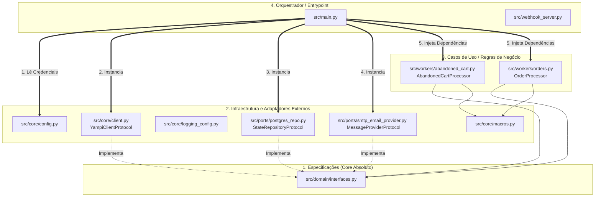

# Árvore de Dependências e Arquitetura do Projeto

Este documento detalha o mapa de dependências de alto nível do sistema, seguindo os princípios estabelecidos na documentação de Clean Architecture e Spec-Driven Development. A regra de ouro é: **A Regra de Negócio (Workers/Domain) não depende de detalhes externos (Banco/APIs); os detalhes externos implementam contratos do domínio.**

## 1. Diagrama de Injeção de Dependências (Hexagonal Architecture)

---

## 2. Fluxo Estrutural de Injeção (Passo a Passo)

A hierarquia de dependências flui de fora (Entrypoint) para dentro (Domain), garantindo desacoplamento total.

### Nível 1: O Domínio (`src/domain/`)
- **Quem é:** O coração da aplicação (ex: `interfaces.py`).
- **Do que depende:** De ninguém.
- **O que faz:** Dita as regras do jogo. Define os `Protocols` que qualquer banco de dados, provedor de email ou cliente Yampi deve obedecer se quiser existir no sistema.

### Nível 2: Infraestrutura (`src/core/` e `src/ports/`)
- **Quem são:** `client.py` (Yampi), `postgres_repo.py` (PostgreSQL), `smtp_email_provider.py` (SMTP), `logging_config.py` (Logs).
- **Do que dependem:** Do `domain/` (para herdar/implementar os contratos) e de bibliotecas externas (`psycopg2`, `requests`, `smtplib`, `logging`).
- **O que fazem:** Lidam com o mundo real (Internet, Banco de Dados, APIs, Saída de Sistema).

### Nível 3: Casos de Uso (`src/workers/`)
- **Quem são:** `abandoned_cart.py` e `orders.py`.
- **Do que dependem:** Estritamente do `domain/` (recebem instâncias no construtor com os *type hints* das interfaces) e de `core/macros.py` (para usar as variáveis de tempo estipuladas na lógica de negócio).
- **O que fazem:** Executam a **Máquina de Estados de E-mails (STG/STC)**, lendo dados, tomando decisões lógicas e pedindo para enviar e-mails. Não sabem se estão escrevendo no SQLite ou no Postgres, nem se estão mandando e-mail ou WhatsApp.

### Nível 4: Entrypoints (`src/main.py`)
- **Quem é:** O roteador principal, geralmente engatilhado por um Cron ou manualmente.
- **Do que depende:** De **todos** os módulos.
- **O que faz:** Ele é a "fábrica". Lê o `.env` do `config.py`, cria o banco `PostgresRepo()`, cria o `YampiClient()`, cria o `SMTPProvider()`, junta tudo isso no construtor do `OrderProcessor(client, repo, provider)` e finalmente aperta o botão `processor.execute()`.
