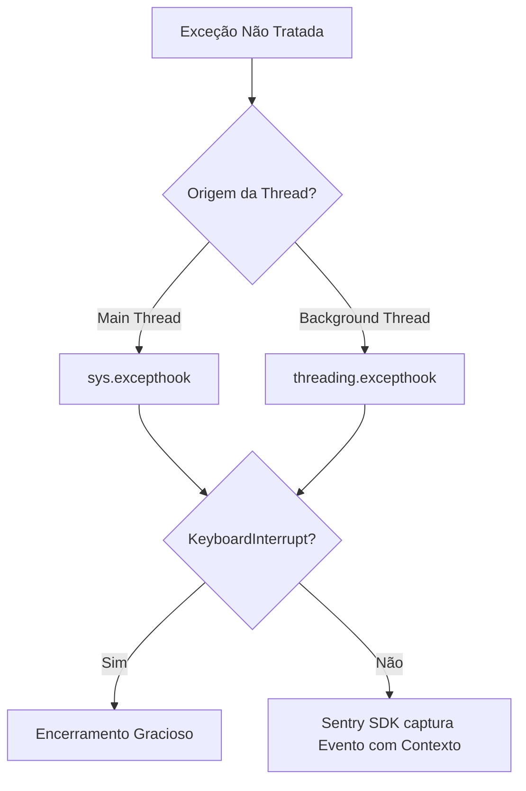

# Especificação Técnica de Telemetria e Observabilidade (Sentry)

**Status:** Ativo / Produção  
**Padrão:** Spec-Driven Architecture  
**Módulos Responsáveis:** `src/core/logging_config.py`, `src/daemon.py`, `src/webhook_server.py`, `src/ports/postgres_repo.py`, `src/core/client.py`, `src/workers/`  
**Referência Histórica e Aulas:** [`project_decisions/antigos/08_sentry_aulas_praticas.md`](file:///home/luska/Documents/projects/message_integration/project_decisions/antigos/08_sentry_aulas_praticas.md) e [`project_decisions/antigos/08_sentry_architecture_and_potential.md`](file:///home/luska/Documents/projects/message_integration/project_decisions/antigos/08_sentry_architecture_and_potential.md).

---

## 1. Visão Geral e Contrato de Telemetria

O sistema utiliza o **Sentry SDK** (`v2.66.1+`) como infraestrutura primária e exclusiva de telemetria para:
1. **Rastreamento de Falhas e Erros Globais (Error Tracking)**: Interceptação determinística em threads principais e assíncronas.
2. **Performance e Rastreamento Distribuído (APM - Spans & Transactions)**: Medição de latência em milissegundos para chamadas HTTP externas e queries no PostgreSQL.
3. **Sinal de Vida do Processo (Sentry Crons / Heartbeats)**: Monitoramento de liveness do daemon cíclico de recuperação.
4. **Rastreabilidade de Negócio (Breadcrumbs)**: Gravação de transições de estados (`STG` e `STC`) sem geração de ruído ou falsos positivos.

---

## 2. Invariantes de Configuração e Ambiente (`.env`)

A inicialização da telemetria é governada por três variáveis de ambiente obrigatórias:

| Variável | Tipo | Padrão | Descrição e Invariante |
| :--- | :--- | :--- | :--- |
| `SENTRY_DSN` | `string` | `None` | Endpoint HTTPS de ingestão do projeto no Sentry. Se ausente, o sistema opera em modo isolado/offline sem falhas. |
| `TRACES_SAMPLE_RATE` | `float` | `1.0` | Taxa de amostragem de APM (0.0 a 1.0). `1.0` representa 100% de captura de spans. |
| `ENVIRONMENT` | `string` | `"production"` | Segmentador de métricas (`production`, `staging`, `development`). Previne poluição de dados reais com testes locais. |

---

## 3. Arquitetura de Interceptação e Segurança (LGPD)

### 3.1. Zero-Crash & Data Scrubbing
A inicialização em [`src/core/logging_config.py`](file:///home/luska/Documents/projects/message_integration/src/core/logging_config.py) cumpre os seguintes requisitos contratuais:
- **`send_default_pii=False`**: É estritamente proibido enviar dados pessoais identificáveis (CPF, nomes, dados de cartão ou credenciais) nos payloads de telemetria.
- **Supressão de Stack Trace em Disco**: Em caso de erros fatais globais, a stack trace completa é encaminhada de forma criptografada para o Sentry, evitando o despejo de credenciais em texto claro no `app.log`.

### 3.2. Hooks Globais de Exceção Não Tratada


---

## 4. Catálogo de Transações e Spans de Performance (APM)

O sistema instrumenta manualmente operações críticas de I/O para garantir visibilidade da cascata de execução (*Waterfall Chart*):

```mermaid
gantt
    title Cascata Típica de Execução (Ciclo do Daemon)
    dateFormat X
    axisFormat %s s
    section API Yampi
    GET /abandoned-carts (op: http.client) : 0, 350
    section Banco de Dados
    Postgres upsert_from_cart (op: db.sql.query) : 350, 365
    section Máquina de Estados
    Breadcrumb STC0 -> STC1 (categoria: cart_state_machine) : 365, 366
    section Envio
    SMTP / WhatsApp Dispatch : 366, 500
```



### 4.1. Tabela de Spans Instrumentados

| Operação (`op`) | Localização no Código | Descrição / Payload |
| :--- | :--- | :--- |
| `http.client` | [`src/core/client.py`](file:///home/luska/Documents/projects/message_integration/src/core/client.py) | Medição de latência e status code de cada requisição HTTP para a API REST da Yampi. |
| `db.sql.query` | [`src/ports/postgres_repo.py`](file:///home/luska/Documents/projects/message_integration/src/ports/postgres_repo.py) | Medição de tempo de execução de queries, inserts e updates no PostgreSQL. |
| `/webhook` | [`src/webhook_server.py`](file:///home/luska/Documents/projects/message_integration/src/webhook_server.py) | Transação Flask capturada via `FlaskIntegration` para requisições recebidas da Meta WhatsApp API. |

---

## 5. Especificação do Monitor de Vida do Daemon (Sentry Crons)

O orquestrador [`src/daemon.py`](file:///home/luska/Documents/projects/message_integration/src/daemon.py) executa em regime de *Heartbeat Monitoring*:

* **Slug Obrigatório:** `yampi-daemon-cycle`
* **Periodicidade:** 5 Minutos (`MACRO_DAEMON_SLEEP_INTERVAL_SEG = 300`)
* **Timezone:** `America/Sao_Paulo`
* **Margem de Tolerância (Grace Period):** 2 Minutos
* **Tempo Limite de Execução (Max Runtime):** 5 Minutos
* **Threshold de Alerta:** 1 falha consecutiva dispara alerta imediato de inatividade.

---

## 6. Especificação de Breadcrumbs (Rastreabilidade de Estados)

Os workers de processamento registram breadcrumbs estruturados antes de operações de I/O de alto risco:

| Categoria | Origem | Estrutura de Dados (`data`) | Finalidade |
| :--- | :--- | :--- | :--- |
| `order_state_machine` | [`src/workers/orders.py`](file:///home/luska/Documents/projects/message_integration/src/workers/orders.py) | `{"order_id": str, "from": int, "to": int}` | Contextualiza exatamente qual pedido e transição de STG estavam ativos no momento de uma exceção. |
| `cart_state_machine` | [`src/workers/abandoned_cart.py`](file:///home/luska/Documents/projects/message_integration/src/workers/abandoned_cart.py) | `{"cart_id": str, "from": int, "to": int}` | Registra transições de STC (15m, 24h, 72h) para auditoria de réguas de desconto. |
| `src.workers.*` | Sistema de Logs (`logging`) | Mensagens de nível `INFO` ou `WARNING` | Histórico sequencial do pipeline de lote antes de qualquer falha. |

---

## 7. Matriz de Consulta Rápida (Cheat Sheet de Filtros)

Para agentes e desenvolvedores formulando queries de telemetria no Sentry:

```text
# Erros não resolvidos em produção
is:unresolved environment:production

# Chamadas à API da Yampi
transaction.op:http.client

# Consultas no Banco de Dados PostgreSQL
transaction.op:db.sql.query

# Requisições ao Servidor de Webhook Flask
transaction:/webhook

# Monitor de Cron do Daemon
cron.slug:yampi-daemon-cycle
```
