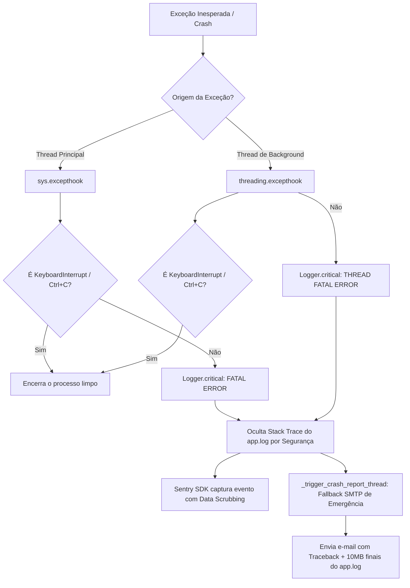

# Estudo e Arquitetura: Uso do Sentry e seu Potencial de Observabilidade

**Data de Criação:** 2026-08-07  
**Versão:** 1.0.0  
**Status:** Aprovado / Referência Técnica  
**Módulo:** `src/core/logging_config.py`, `src/daemon.py`, `src/webhook_server.py`, `src/workers/`  
**Escopo:** Diagnóstico completo da integração atual do Sentry SDK (`v2.66.1`), arquitetura de interceptação global, segurança de dados (LGPD/Data Scrubbing) e catálogo de potencialidades para evolução do sistema.

---

## 1. O que é o Sentry e por que ele é Estratégico?

O **Sentry** é uma plataforma de monitoramento de integridade de aplicações (Application Performance Monitoring - APM & Error Tracking) em tempo real. Diferente de um visualizador de logs tradicional (que apenas armazena linhas de texto cronológicas em disco), o Sentry:

1. **Agrupa Erros por Causa-Raiz (Fingerprinting)**: Se uma falha na API da Yampi acontecer 10.000 vezes em 1 hora, o Sentry não cria 10.000 notificações desordenadas; ele agrupa tudo em um único *Issue*, mostrando a frequência, o primeiro evento, o último evento e a curva de ocorrência.
2. **Captura Contexto de Execução Rico**: Registra a *stack trace* completa com código-fonte, variáveis locais de cada frame (com higienização de dados sensíveis), versão do interpretador Python, sistema operacional, consumo de memória e parâmetros de runtime.
3. **Rastreia a Linha do Tempo (Breadcrumbs)**: Grava os passos que a aplicação deu antes do erro acontecer (ex: "carregou configuração" → "conectou ao banco" → "fez GET na Yampi" → "caiu com timeout").
4. **Monitora Performance e Transações (Distributed Tracing)**: Mede o tempo gasto em cada fatia do processamento (ex: quanto tempo demorou o `SELECT` no PostgreSQL vs a chamada HTTP na Yampi vs a renderização do template MJML).

---

## 2. Como o Sentry está Implementado no Projeto Hoje

A integração do Sentry no `message_integration` foi introduzida oficialmente na versão `v6.2.0` e está concentrada no módulo central de telemetria: [`src/core/logging_config.py`](file:///home/luska/Documents/projects/message_integration/src/core/logging_config.py).

### 2.1. Ponto de Inicialização Resiliente

```python
# Trecho de src/core/logging_config.py
sentry_dsn = os.environ.get("SENTRY_DSN")
if sentry_dsn:
    try:
        import sentry_sdk
        sentry_sdk.init(
            dsn=sentry_dsn,
            traces_sample_rate=1.0,
            send_default_pii=False, # Data Scrubbing habilitado
        )
    except (ImportError, Exception) as e:
        logging.warning(f"Não foi possível inicializar o Sentry SDK: {e}")
```

#### Princípios de Engenharia Aplicados:
- **Zero-Crash por Dependência Externa**: Se o pacote `sentry-sdk` não estiver instalado ou se o `SENTRY_DSN` for inválido/inexistente no `.env`, a aplicação não quebra. Ela emite um aviso no log e continua sua operação normalmente em modo local.
- **Detecção Automática de Ambiente**: Se `SENTRY_DSN` não for fornecido (ambiente de testes locais ou desenvolvimento offline), o sistema opera em modo isolado.
- **Taxa de Amostragem Total (`traces_sample_rate=1.0`)**: 100% das transações e erros são enviados para o dashboard na nuvem, garantindo auditoria completa.

---

### 2.2. Interceptação Global de Erros Não Tratados (`sys.excepthook` e `threading.excepthook`)

No ecossistema Python tradicional, quando uma exceção não é tratada por um `try/except`, o interpretador imprime o traceback no `stderr` e aborta a execução do processo ou da thread. No `message_integration`, essa dinâmica foi modificada para garantir resiliência operacional:



### 2.3. Arquitetura de Redundância: Sentry + Fallback SMTP

O sistema adota uma estratégia de defesa em profundidade com duas camadas de alerta:

| Canal | Papel Arquitetural | Vantagem Principal |
| :--- | :--- | :--- |
| **Sentry Cloud** | **Observabilidade Principal** | Dashboard interativo, gráficos de tendência, agrupamento automático de incidentes, alertas em tempo real e isolamento seguro de PII. |
| **Fallback SMTP** (`_trigger_crash_report_thread`) | **Caixa-Preta de Emergência** | Dispara um e-mail direto para o mantenedor via SMTP com os últimos ~10MB do `app.log` anexados, funcionando mesmo se a conexão externa com o Sentry for bloqueada por firewall ou restrições de rede. |

---

## 3. Segurança de Dados e LGPD: `send_default_pii=False`

Por se tratar de um sistema de mensageria de e-commerce que manipula dados sensíveis de clientes (CPF, e-mail, nomes, endereços e valores de pedidos da Yampi), a segurança é mandatória:

1. **`send_default_pii=False`**: Garante que o SDK do Sentry descarte automaticamente dados de identificação pessoal de cabeçalhos HTTP, variáveis de ambiente sensíveis e payloads de clientes antes do envio para a nuvem.
2. **Omissão do Traceback do Disco (`app.log`)**: Em caso de erros fatais globais, a stack trace detalhada (que poderia conter variáveis locais com tokens de API da Yampi ou senhas de banco) não é despejada em texto plano não criptografado no log compartilhado do container, ficando restrita ao Sentry e ao e-mail criptografado do administrador.

---

## 4. O Potencial Inexplorado do Sentry para o Projeto

Embora a captura básica de exceções globais já esteja ativa, o Sentry oferece recursos avançados que podem elevar o nível de maturidade do `message_integration` para padrão *Enterprise*.

---

### Potencial 1: Monitoramento de Daemons e Cronjobs (Sentry Crons) `[✅ IMPLEMENTADO]`

**Cenário Atual**: O [`src/daemon.py`](file:///home/luska/Documents/projects/message_integration/src/daemon.py) executa um loop infinito com intervalo parametrizado em `MACRO_DAEMON_SLEEP_INTERVAL_SEG` (5 minutos). Se a máquina virtual congelar, o processo for morto silenciosamente pelo OOM Killer do Linux ou a thread travar em uma chamada de rede sem timeout, **ninguém fica sabendo até que os clientes reclamem**.

**Solução com Sentry Crons (Heartbeat Monitoring)**:
Implementado no `src/daemon.py` envolvendo o `run_all()` com `sentry_sdk.crons.monitor(monitor_slug="yampi-daemon-cycle")`. O Sentry monitora os *Check-Ins* de início e fim de cada ciclo do daemon disparando alerta em caso de inatividade.

```python
import sentry_sdk
from sentry_sdk.crons import monitor

def run_daemon_cycle():
    # O monitor envia um ping no início e outro no final da execução
    with sentry_sdk.crons.monitor(monitor_slug="yampi-daemon-cycle"):
        run_all()
```

---

### Potencial 2: Distributed Tracing & APM nos Workers e Repositório (Spans de Performance) `[✅ IMPLEMENTADO]`

**Cenário**: Saber com precisão milimétrica onde o tempo de processamento é consumido (rede, API Yampi ou consultas SQL no PostgreSQL).

**Solução com Spans do Sentry**:
Implementado no [`src/core/client.py`](file:///home/luska/Documents/projects/message_integration/src/core/client.py) (`op="http.client"`) e no [`src/ports/postgres_repo.py`](file:///home/luska/Documents/projects/message_integration/src/ports/postgres_repo.py) (`op="db.sql.query"`).

```python
import sentry_sdk

class OrderProcessor:
    def process(self):
        with sentry_sdk.start_transaction(op="worker", name="OrderProcessor.process"):
            
            with sentry_sdk.start_span(op="yampi.api", description="GET /v2/orders (Fetch Orders)"):
                orders = self.api_client.get_orders()
                
            with sentry_sdk.start_span(op="db.query", description="PostgreSQL State Check"):
                pending = self.state_repo.filter_unprocessed_orders(orders)
                
            with sentry_sdk.start_span(op="smtp.dispatch", description="Render and Send MJML Emails"):
                self.dispatch_notifications(pending)
```

**Benefício no Dashboard**:
- O Sentry desenha uma barra em cascata (*Waterfall Chart*) mostrando exatamente se a lentidão foi na API da Yampi (ex: 8.2s), na consulta SQL (ex: 12ms) ou na renderização do MJML (ex: 350ms).

---

### Potencial 3: Breadcrumbs Customizados no Pipeline de Negócio `[✅ IMPLEMENTADO]`

*Breadcrumbs* são como "migalhas de pão" que o código vai deixando pelo caminho. Quando um erro acontece, o Sentry exibe o histórico exato do que aconteceu nos passos anteriores.

**Implementação**: Adicionado em [`src/workers/orders.py`](file:///home/luska/Documents/projects/message_integration/src/workers/orders.py) e [`src/workers/abandoned_cart.py`](file:///home/luska/Documents/projects/message_integration/src/workers/abandoned_cart.py) registrando as transições da máquina de estado (`STG` e `STC`).

```python
import sentry_sdk

def transition_order_state(order_id: str, old_stg: int, new_stg: int):
    # Deixa um rastro no Sentry sem enviar um erro
    sentry_sdk.add_breadcrumb(
        category="order_state_machine",
        message=f"Pedido {order_id} transitou de STG {old_stg} para STG {new_stg}",
        level="info",
        data={"order_id": order_id, "from": old_stg, "to": new_stg}
    )
```

Se o envio do e-mail falhar 3 linhas depois, você verá exatamente qual pedido estava sendo processado e de qual estado ele veio!

---

### Potencial 4: Tags e Contextos de Domínio

Tags permitem filtrar e buscar erros no painel do Sentry com máxima agilidade:

```python
import sentry_sdk

# Adiciona tags contextuais durante a execução
sentry_sdk.set_tag("merchant_alias", config.YAMPI_ALIAS)
sentry_sdk.set_tag("app_version", config.APP_VERSION)
sentry_sdk.set_tag("execution_mode", "DRY_RUN" if not macros.MACRO_ENABLE_REAL_EMAIL_DISPATCH else "PRODUCTION")
```

**Consultas Possíveis no Dashboard do Sentry**:
- `merchant_alias:loja_alpha is:unresolved`
- `execution_mode:PRODUCTION error.type:SMTPException`
- `app_version:v6.2.0`

---

### Potencial 5: Monitoramento do Servidor de Webhooks (`src/webhook_server.py`) `[✅ IMPLEMENTADO]`

O Sentry possui integração nativa com o Flask (`FlaskIntegration`). Foi implementado no [`src/webhook_server.py`](file:///home/luska/Documents/projects/message_integration/src/webhook_server.py) para que cada requisição recebida nos endpoints de webhook (`/webhook`, etc.) seja automaticamente monitorada quanto a:
- Tempo de resposta (latência de requisição).
- Taxa de requisições por segundo (Throughput).
- Erros de rota (404), erros de servidor (500) e payloads malformados (400).

```python
from sentry_sdk.integrations.flask import FlaskIntegration

sentry_sdk.init(
    dsn=sentry_dsn,
    integrations=[FlaskIntegration()],
    traces_sample_rate=1.0
)
```

---

### Potencial 6: Fingerprinting Customizado para a API da Yampi

Por padrão, se duas chamadas HTTP falharem com `requests.exceptions.HTTPError: 429 Client Error (Too Many Requests)`, o Sentry pode agrupá-las juntas. Com **Fingerprinting**, podemos instruir o Sentry a separar erros que exigem ações operacionais diferentes:

```python
import sentry_sdk

def handle_api_error(status_code: int, endpoint: str):
    if status_code == 429:
        # Agrupa todos os 429 da Yampi em um issue único de Rate Limit
        sentry_sdk.set_fingerprint(["yampi-rate-limit", endpoint])
    elif status_code in (502, 503, 504):
        # Agrupa instabilidades nos servidores da Yampi
        sentry_sdk.set_fingerprint(["yampi-upstream-downtime", endpoint])
```

---

### Potencial 7: Alertas Inteligentes e Canais de Comunicação (ChatOps)

O Sentry se conecta nativamente a:
- **Discord / Slack**: Notifica o canal da equipe de tecnologia imediatamente quando um erro novo é detectado pela primeira vez.
- **Telegram / WhatsApp**: Alerta de plantão para falhas críticas de status de pedidos.
- **Regras de Alerta por Frequência**: Só avisar se o mesmo erro acontecer mais de 10 vezes em 5 minutos (evita *alert fatigue* com falhas pontuais de rede).

---

## 5. Matriz Comparativa de Ferramentas de Observabilidade

| Critério | Arquivo Local (`app.log`) | E-mail SMTP de Crash | Sentry SDK (Cloud) |
| :--- | :--- | :--- | :--- |
| **Persistência** | Local no disco do container | Caixa de entrada de e-mail | Nuvem distribuída com retenção |
| **Agrupamento de Erros** | ❌ Não (Linha a linha) | ❌ Não (1 e-mail por crash) | ✅ Sim (Agrupamento inteligente por fingerprint) |
| **Métricas de Performance (APM)** | ❌ Não | ❌ Não | ✅ Sim (Spans, latência, throughput) |
| **Alerta de Inatividade (Downtime)** | ❌ Não | ❌ Não | ✅ Sim (Sentry Crons / Heartbeats) |
| **Histórico de Execução (Breadcrumbs)** | ⚠️ Manual (via log) | ⚠️ Manual (via anexo do log) | ✅ Automático e estruturado |
| **LGPD e Proteção de PII** | ⚠️ Exige cuidado manual | ⚠️ Pode vazar dados no anexo | ✅ Filtros e mascaramento nativos |
| **Impacto em Falhas de Rede** | ✅ Grava sempre | ❌ Falha se SMTP estiver inacessível | ❌ Requer saída HTTP |

---

## 6. Status de Execução do Plano de Observabilidade (Fase 2)

Todas as metas essenciais da Fase 2 foram integradas ao código de produção:

1. **Passo 1 (Concluído - Curto Prazo)**:
   - Configurado `Sentry Crons` (`yampi-daemon-cycle`) no [`src/daemon.py`](file:///home/luska/Documents/projects/message_integration/src/daemon.py).
   - Centralizado intervalo de sleep na macro `MACRO_DAEMON_SLEEP_INTERVAL_SEG` em [`src/core/macros.py`](file:///home/luska/Documents/projects/message_integration/src/core/macros.py).
2. **Passo 2 (Concluído - Médio Prazo)**:
   - Integrado `FlaskIntegration` e leitura de `TRACES_SAMPLE_RATE` no [`src/webhook_server.py`](file:///home/luska/Documents/projects/message_integration/src/webhook_server.py).
   - Inseridos *Breadcrumbs* nas transições da máquina de estados (`STG` e `STC`) nos workers [`src/workers/orders.py`](file:///home/luska/Documents/projects/message_integration/src/workers/orders.py) e [`src/workers/abandoned_cart.py`](file:///home/luska/Documents/projects/message_integration/src/workers/abandoned_cart.py).
3. **Passo 3 (Concluído - Longo Prazo)**:
   - Adicionados Spans de APM (`http.client`) nas chamadas HTTP do [`src/core/client.py`](file:///home/luska/Documents/projects/message_integration/src/core/client.py).
   - Adicionados Spans de APM (`db.sql.query`) nas operações de banco de dados do [`src/ports/postgres_repo.py`](file:///home/luska/Documents/projects/message_integration/src/ports/postgres_repo.py).
