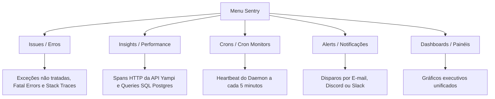
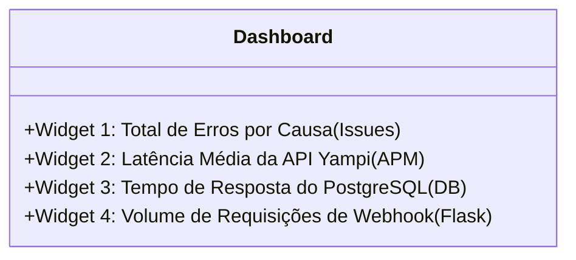

# Manual e Aulas Práticas: Guia de Navegação no Sentry Website (Histórico)

**Data de Registro:** 2026-08-08  
**Tipo:** Guia Prático / Tutorial Passo a Passo para Humanos  
**Origem:** Transcrição das aulas de navegação na interface web do Sentry ([sentry.io](https://sentry.io)).  
**Documentação Spec-Driven Oficial:** Consulte [`docs/sentry_dashboard_guide.md`](file:///home/luska/Documents/projects/message_integration/docs/sentry_dashboard_guide.md).

---

## Sumário das Aulas

* [Pré-requisitos: Verificação de Variáveis de Ambiente](#pré-requisitos-verificação-de-variáveis-de-ambiente)
* [Aula 1: Mapa Mental da Interface do Sentry (Issues vs. APM/Performance)](#aula-1-mapa-mental-da-interface-do-sentry-issues-vs-apmperformance)
* [Aula 2: Monitoramento de Vida do Daemon com Sentry Crons (Heartbeats)](#aula-2-monitoramento-de-vida-do-daemon-com-sentry-crons-heartbeats)
* [Aula 3: Explorando APM & Performance (Latência da API Yampi e Consultas Postgres)](#aula-3-explorando-apm--performance-latência-da-api-yampi-e-consultas-postgres)
* [Aula 4: Monitorando o Servidor de Webhooks (Meta WhatsApp API)](#aula-4-monitorando-o-servidor-de-webhooks-meta-whatsapp-api)
* [Aula 5: Rastreando a Linha do Tempo com Breadcrumbs da Máquina de Estados](#aula-5-rastreando-a-linha-do-tempo-com-breadcrumbs-da-máquina-de-estados)
* [Aula 6: Configurando Alertas Inteligentes (E-mail, Discord e Slack)](#aula-6-configurando-alertas-inteligentes-e-mail-discord-e-slack)
* [Aula 7: Criando um Dashboard Executivo Unificado](#aula-7-criando-um-dashboard-executivo-unificado)

---

## Pré-requisitos: Verificação de Variáveis de Ambiente

Para que todas as métricas (não apenas erros) apareçam no painel, o seu arquivo `.env` precisa estar com as seguintes chaves ativas:

```bash
# URL DSN do seu projeto no Sentry
SENTRY_DSN="https://exemplo@sentry.io/123456"

# Taxa de amostragem de performance: 1.0 envia 100% dos spans de APM (Yampi e Postgres)
TRACES_SAMPLE_RATE="1.0"

# Identificador do ambiente no Sentry (ex: production, staging, development)
ENVIRONMENT="production"
```

> [!NOTE]
> * **`TRACES_SAMPLE_RATE`**: Se não estiver definido, o padrão configurado no código é `1.0`. Em planos gratuitos no futuro, você pode mudar para `0.2` (amostra de 20%).
> * **`ENVIRONMENT`**: Permite alternar no topo do site do Sentry entre métricas reais de clientes (`production`) e testes locais de homologação (`development`), evitando alertas falsos.

---

## Aula 1: Mapa Mental da Interface do Sentry (Issues vs. APM/Performance)

Ao entrar no [sentry.io](https://sentry.io) e selecionar o seu projeto, o menu lateral esquerdo divide a telemetria em categorias essenciais:



### Por que você só via erros até agora?
Por padrão, a página inicial do Sentry abre na aba **Issues**. Uma *Issue* é gerada **apenas quando ocorre um erro ou exceção**. 

Métricas normais de funcionamento (quantas chamadas HTTP foram feitas, quanto tempo o banco demorou, se o daemon está vivo) não são erros; elas ficam localizadas nas abas **Crons**, **Performance / Insights** e **Dashboards**.

---

## Aula 2: Monitoramento de Vida do Daemon com Sentry Crons (Heartbeats)

O `src/daemon.py` roda um loop infinito a cada 5 minutos (`MACRO_DAEMON_SLEEP_INTERVAL_SEG = 300`). Ele é instrumentado com o slug:
`MACRO_SENTRY_CRON_MONITOR_SLUG = "yampi-daemon-cycle"`

### 🎯 Objetivo
Garantir que se o servidor congelar, o container Docker cair ou a máquina ficar sem memória (OOM), o Sentry avise que o daemon parou de rodar.

### 🛠️ Criação e Provisionamento Automático no Sentry:
Com a introdução do `monitor_config` no `sentry-sdk` (disponível a partir da v1.45.0 e ativo na versão do projeto `2.66.1`), **a criação do monitor é 100% automática**!
Assim que o `src/daemon.py` inicia seu primeiro ciclo, ele envia a estrutura do monitor via código com:
* **Schedule Interval**: `5 Minutes` (`MACRO_DAEMON_SLEEP_INTERVAL_SEG = 300`)
* **Timezone**: `America/Sao_Paulo` (Horário de Brasília)
* **Check-in Margin (Tolerância)**: `2 Minutes`
* **Max Runtime**: `5 Minutes`
* **Thresholds**: 1 falha para disparar alerta e 1 sucesso para recuperação.

O Sentry cria e atualiza o monitor com o slug `yampi-daemon-cycle` na nuvem sem necessidade de nenhuma ação manual.

### 🛠️ Visualização no Sentry Website:
1. No menu lateral esquerdo, clique em **Crons** (ou **Insights > Cron Monitors**).
2. Você verá o monitor chamado `yampi-daemon-cycle` listado e ativo.
3. Caso queira inspecionar ou criar manualmente um monitor idêntico:
   * **Monitor Name**: `Daemon Yampi Message Integration`
   * **Monitor Slug**: `yampi-daemon-cycle` *(⚠️ OBRIGATÓRIO: precisa ser exatamente esse nome)*.
   * **Schedule Type**: Escolha **Interval** (ou Periodic).
   * **Interval**: `5` **Minutes**.
   * **Grace Period (Tolerância)**: `2` **Minutes**.
   * **Max Runtime**: `5` **Minutes**.

### 📊 Como Interpretar o Status do Monitor:
* 🟢 **OK (Verde)**: O daemon está vivo, rodando a cada 5 minutos e enviando check-ins.
* 🟡 **In Progress (Azul/Amarelo)**: O daemon iniciou um ciclo de processamento e está executando as regras.
* 🔴 **Missed (Vermelho)**: **ALERTA!** O daemon não enviou o sinal de vida no tempo esperado. Significa que o processo morreu, travou em rede ou o Docker parou.
* 🔴 **Error (Vermelho)**: Uma exceção não tratada interrompeu o ciclo antes da finalização.

> [!NOTE]
> **Por que a coluna "STARTED" às vezes fica como "Not Sent"?**
> Como as execuções do daemon costumam ser rápidas (menos de 1 minuto), o SDK do Sentry faz *buffering* e muitas vezes envia o sinal de início (`in_progress`) e o sinal de fim (`ok`) no mesmo pacote. Quando os servidores recebem ambos simultaneamente, a interface processa apenas o resultado final (`ok`). 
> Isso é **perfeitamente normal** e esperado! O monitoramento continua exato, pois o próprio SDK calcula a duração e a envia no evento final, mantendo as métricas de tempo (Duration) perfeitamente precisas na interface.

---

## Aula 3: Explorando APM & Performance (Latência da API Yampi e Consultas Postgres)

O código possui dois rastreadores manuais de latência:
1. `op="http.client"`: Registrado no `src/core/client.py` para medir cada requisição HTTP feita para a Yampi.
2. `op="db.sql.query"`: Registrado no `src/ports/postgres_repo.py` para medir cada execução de query SQL no PostgreSQL.

### 🎯 Objetivo
Ver exatamente quantos milissegundos a API da Yampi demora para responder e identificar se o banco de dados PostgreSQL está rápido ou com gargalos.

### 🛠️ Passo a Passo no Sentry Website:
1. No menu lateral esquerdo, clique em **Performance** (ou **Insights > Queries / HTTP**).
2. Você verá a lista de **Transactions** capturadas pelo sistema.
3. No campo de busca (**Search**), você pode filtrar pelos spans específicos do nosso código:

#### 🔍 Filtro para Ver Chamadas à API Yampi:
Digite na barra de busca:
```text
transaction.op:http.client
```
Ou abra a aba **HTTP / Outgoing Requests**:
* Você verá itens como: `Yampi API GET /orders` e `Yampi API GET /abandoned-carts`.
* O Sentry exibirá:
  * **Duration (Duração Média / P95)**: Ex: 350ms.
  * **Throughput**: Quantidade de requisições por minuto.
  * **Status Code Breakdown**: Gráfico com % de 200 OK vs 429 Rate Limit.

#### 🔍 Filtro para Ver Consultas no PostgreSQL:
Digite na barra de busca:
```text
transaction.op:db.sql.query
```
Ou abra a aba **Queries / Database**:
* Você verá itens como: `Postgres upsert_from_cart` e `Postgres update_stg`.
* O Sentry exibirá o tempo médio de execução das queries (geralmente entre 1ms a 10ms).

### 📈 Entendendo o Gráfico em Cascata (Waterfall Chart)
Ao clicar em qualquer transação individual da lista:
1. O Sentry abrirá a visualização em cascata mostrando a linha do tempo completa do ciclo.
2. As barras azuis representam o tempo consumido pela API da Yampi.
3. As barras verdes representam o tempo consumido pelo PostgreSQL.
4. Isso permite saber com precisão de milissegundos se a lentidão foi da rede da Yampi ou do banco local.

---

## Aula 4: Monitorando o Servidor de Webhooks (Meta WhatsApp API)

No arquivo `src/webhook_server.py`, o Flask está integrado nativamente via `FlaskIntegration`.

### 🎯 Objetivo
Acompanhar em tempo real as requisições enviadas pelos servidores da Meta (Facebook/WhatsApp) para o endpoint `/webhook`.

### 🛠️ Passo a Passo no Sentry Website:
1. No menu lateral, acesse **Performance > Requests** (ou **Insights > Web Service**).
2. Na lista de endpoints, clique na rota:
   ```text
   /webhook
   ```
3. O painel exibirá:
   * **Request Rate (RPM)**: Quantos eventos de webhook estão chegando por minuto.
   * **Latency (P50, P75, P95)**: Tempo que o Flask leva para validar o handshake ou processar o JSON.
   * **Failure Rate**: Se a Meta enviar tokens inválidos (retorno 403 Forbidden) ou se houver erros de rota, eles aparecerão categorizados.

---

## Aula 5: Rastreando a Linha do Tempo com Breadcrumbs da Máquina de Estados

No código de `src/workers/orders.py` e `src/workers/abandoned_cart.py`, incluímos rastreadores chamados *Breadcrumbs* (migalhas de pão) com a categoria `order_state_machine` e `cart_state_machine`.

### 🎯 Objetivo
Quando ocorrer qualquer falha inesperada, entender exatamente qual pedido/carrinho estava sendo processado e qual era o seu estado anterior.

### 🛠️ Passo a Passo no Sentry Website:
1. No menu lateral, acesse **Issues**.
2. Clique em qualquer evento de erro registrado na lista.
3. Role a página para baixo até a seção **Breadcrumbs** (Linha do Tempo).
4. Você verá balões cronológicos ordenados por segundo:
   * 🟦 `[http.client] Yampi API GET /orders`
   * 🟩 `[db.sql.query] Postgres upsert_from_cart`
   * 🟨 `[order_state_machine] Pedido #1234 transitou de STG 0 para STG 1`
   * 🔴 `[error] Exception no envio de email`
5. Clicando no breadcrumb `order_state_machine`, você tem acesso ao payload contendo `order_id`, `from_stg` e `to_stg`.

---

## Aula 6: Configurando Alertas Inteligentes (E-mail, Discord e Slack)

Para não precisar abrir o site do Sentry manualmente todo dia, configuramos regras de alertas automáticos.

### 🎯 Objetivo
Receber uma notificação imediata quando:
1. O Daemon parar de rodar (Cron Monitor falhar).
2. A taxa de erros da Yampi subir acima do normal.

### 🛠️ Passo a Passo para Criar Alertas:

#### 1. Alerta para o Daemon Morto (Cron Monitor Alert)
1. No menu lateral, clique em **Alerts** > **Create Alert**.
2. Escolha a opção **Crons / Monitor Failure**.
3. Em **Select Monitor**, selecione `yampi-daemon-cycle`.
4. Em **When**, selecione: `Monitor status changes to Missed or Error`.
5. Em **Set Actions**, selecione o destino:
   * **Send an email to**: Seu e-mail de desenvolvedor.
   * *(Opcional)* **Send a notification to**: Canal do Discord ou Slack via Webhook.
6. Dê um nome ao alerta: `[CRÍTICO] Daemon Yampi Inativo` e clique em **Save Rule**.

#### 2. Alerta para Novos Erros (Issue Alert)
1. Clique em **Alerts** > **Create Alert**.
2. Escolha **Issues**.
3. Em **When an event is captured by Sentry**:
   * Adicione a condição: `An issue is first seen` (Apenas quando for um bug inédito, evitando spam).
4. Em **Actions**:
   * Enviar e-mail de alerta imediato.
5. Clique em **Save Rule**.

---

## Aula 7: Criando um Dashboard Executivo Unificado

Você pode criar uma única tela no Sentry que resume a saúde de todo o projeto em 4 gráficos visuais.

### 🎯 Objetivo
Montar um painel de controle executivo customizado.

### 🛠️ Passo a Passo no Sentry Website:
1. No menu lateral, clique em **Dashboards** > **Create Dashboard**.
2. Escolha **Create Blank Dashboard** e nomeie como `Message Integration - Saúde Geral`.
3. Clique em **Add Widget** e adicione os seguintes 4 blocos:



#### Bloco 1: Contagem de Erros por Tipo (Issues)
* **Title**: `Erros Críticos por Tipo`
* **Visualization**: `Table` ou `Bar Chart`
* **Dataset**: `Errors`
* **Query**: `is:unresolved`
* **Group by**: `issue`

#### Bloco 2: Latência da API Yampi (APM)
* **Title**: `Latência API Yampi (ms)`
* **Visualization**: `Line Chart`
* **Dataset**: `Transactions`
* **Query**: `transaction.op:http.client`
* **Y-Axis**: `avg(transaction.duration)`

#### Bloco 3: Tempo de Consulta do Banco de Dados
* **Title**: `Tempo de Consulta PostgreSQL (ms)`
* **Visualization**: `Line Chart`
* **Dataset**: `Transactions`
* **Query**: `transaction.op:db.sql.query`
* **Y-Axis**: `p95(transaction.duration)`

#### Bloco 4: Throughput de Webhooks da Meta
* **Title**: `Volume de Webhooks Recebidos`
* **Visualization**: `Big Number` ou `Area Chart`
* **Dataset**: `Transactions`
* **Query**: `transaction:/webhook`
* **Y-Axis**: `count()`

4. Clique em **Save Dashboard**.
