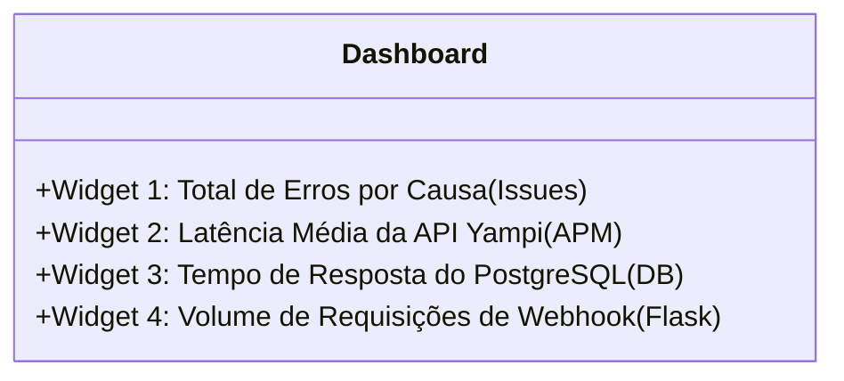

## Aula 4: Monitorando o Servidor de Webhooks (Meta WhatsApp API)

No arquivo `src/webhook_server.py`, o Flask está integrado nativamente via `FlaskIntegration`.

### 🎯 Objetivo
Acompanhar em tempo real as requisições enviadas pelos servidores da Meta (Facebook/WhatsApp) para o endpoint `/webhook`.

### 🛠️ Passo a Passo no Sentry Website:
1. No menu lateral, acesse **Performance > Requests** (ou **Insights > Web Service**).
2. Na lista de endpoints, clique na rota:
   ```text
   /webhook
   ```
3. O painel exibirá:
   * **Request Rate (RPM)**: Quantos eventos de webhook estão chegando por minuto.
   * **Latency (P50, P75, P95)**: Tempo que o Flask leva para validar o handshake ou processar o JSON.
   * **Failure Rate**: Se a Meta enviar tokens inválidos (retorno 403 Forbidden) ou se houver erros de rota, eles aparecerão categorizados.

---

## Aula 5: Rastreando a Linha do Tempo com Breadcrumbs da Máquina de Estados

No código de `src/workers/orders.py` e `src/workers/abandoned_cart.py`, incluímos rastreadores chamados *Breadcrumbs* (migalhas de pão) com a categoria `order_state_machine` e `cart_state_machine`.

### 🎯 Objetivo
Quando ocorrer qualquer falha inesperada, entender exatamente qual pedido/carrinho estava sendo processado e qual era o seu estado anterior.

### 🛠️ Passo a Passo no Sentry Website:
1. No menu lateral, acesse **Issues**.
2. Clique em qualquer evento de erro registrado na lista.
3. Role a página para baixo até a seção **Breadcrumbs** (Linha do Tempo).
4. Você verá balões cronológicos ordenados por segundo:
   * 🟦 `[http.client] Yampi API GET /orders`
   * 🟩 `[db.sql.query] Postgres upsert_from_cart`
   * 🟨 `[order_state_machine] Pedido #1234 transitou de STG 0 para STG 1`
   * 🔴 `[error] Exception no envio de email`
5. Clicando no breadcrumb `order_state_machine`, você tem acesso ao payload contendo `order_id`, `from_stg` e `to_stg`.

---

## Aula 6: Configurando Alertas Inteligentes (E-mail, Discord e Slack)

Para não precisar abrir o site do Sentry manualmente todo dia, configuramos regras de alertas automáticos.

### 🎯 Objetivo
Receber uma notificação imediata quando:
1. O Daemon parar de rodar (Cron Monitor falhar).
2. A taxa de erros da Yampi subir acima do normal.

### 🛠️ Passo a Passo para Criar Alertas:

#### 1. Alerta para o Daemon Morto (Cron Monitor Alert)
1. No menu lateral, clique em **Alerts** > **Create Alert**.
2. Escolha a opção **Crons / Monitor Failure**.
3. Em **Select Monitor**, selecione `yampi-daemon-cycle`.
4. Em **When**, selecione: `Monitor status changes to Missed or Error`.
5. Em **Set Actions**, selecione o destino:
   * **Send an email to**: Seu e-mail de desenvolvedor.
   * *(Opcional)* **Send a notification to**: Canal do Discord ou Slack via Webhook.
6. Dê um nome ao alerta: `[CRÍTICO] Daemon Yampi Inativo` e clique em **Save Rule**.

#### 2. Alerta para Novos Erros (Issue Alert)
1. Clique em **Alerts** > **Create Alert**.
2. Escolha **Issues**.
3. Em **When an event is captured by Sentry**:
   * Adicione a condição: `An issue is first seen` (Apenas quando for um bug inédito, evitando spam).
4. Em **Actions**:
   * Enviar e-mail de alerta imediato.
5. Clique em **Save Rule**.

---

## Aula 7: Criando um Dashboard Executivo Unificado

Você pode criar uma única tela no Sentry que resume a saúde de todo o projeto em 4 gráficos visuais.

### 🎯 Objetivo
Montar um painel de controle executivo customizado.

### 🛠️ Passo a Passo no Sentry Website:
1. No menu lateral, clique em **Dashboards** > **Create Dashboard**.
2. Escolha **Create Blank Dashboard** e nomeie como `Message Integration - Saúde Geral`.
3. Clique em **Add Widget** e adicione os seguintes 4 blocos:



#### Bloco 1: Contagem de Erros por Tipo (Issues)
* **Title**: `Erros Críticos por Tipo`
* **Visualization**: `Table` ou `Bar Chart`
* **Dataset**: `Errors`
* **Query**: `is:unresolved`
* **Group by**: `issue`

#### Bloco 2: Latência da API Yampi (APM)
* **Title**: `Latência API Yampi (ms)`
* **Visualization**: `Line Chart`
* **Dataset**: `Transactions`
* **Query**: `transaction.op:http.client`
* **Y-Axis**: `avg(transaction.duration)`

#### Bloco 3: Tempo de Consulta do Banco de Dados
* **Title**: `Tempo de Consulta PostgreSQL (ms)`
* **Visualization**: `Line Chart`
* **Dataset**: `Transactions`
* **Query**: `transaction.op:db.sql.query`
* **Y-Axis**: `p95(transaction.duration)`

#### Bloco 4: Throughput de Webhooks da Meta
* **Title**: `Volume de Webhooks Recebidos`
* **Visualization**: `Big Number` ou `Area Chart`
* **Dataset**: `Transactions`
* **Query**: `transaction:/webhook`
* **Y-Axis**: `count()`

4. Clique em **Save Dashboard**.

---

## Resumo dos Slugs e Identificadores do Projeto

Guarde esta tabela para consulta rápida ao criar filtros e regras no Sentry:

| Recurso no Código | Identificador / Slug no Sentry | Onde Encontrar no Site |
| :--- | :--- | :--- |
| **Daemon Heartbeat** | `yampi-daemon-cycle` | Aba **Crons** |
| **Chamadas HTTP Yampi** | `op:http.client` | Aba **Performance > HTTP** |
| **Queries PostgreSQL** | `op:db.sql.query` | Aba **Performance > Queries** |
| **Servidor de Webhook** | `/webhook` | Aba **Performance > Requests** |
| **Transições STG/STC** | `order_state_machine`, `cart_state_machine` | Dentro das **Issues > Breadcrumbs** |
| **Taxa de Amostragem** | `TRACES_SAMPLE_RATE="1.0"` | Configurado no `.env` |