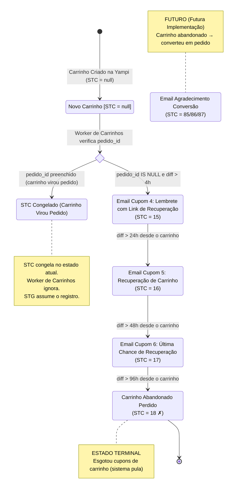
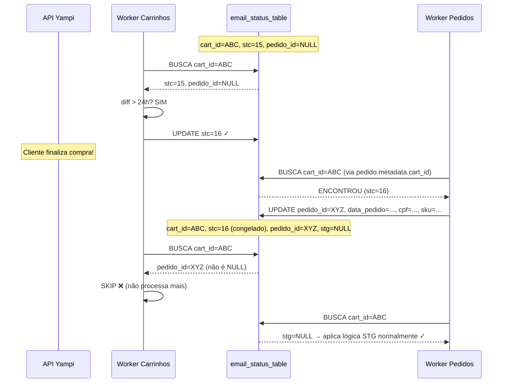

# Diagrama de Estados — STC (Carrinhos Abandonados)

**Data de Criação:** 2026-07-21  
**Referência:** [email_state_machine.md](../../docs/email_state_machine.md)

---

## Legenda

- **Referência temporal**: `diff = now() - data_carrinho` (sempre absoluto)
- **Condição de entrada**: o worker de carrinhos **só processa** registros onde `pedido_id IS NULL`
- **Congelamento**: quando `pedido_id` é preenchido, o STC **congela** no valor que está e nunca mais é alterado pelo worker de carrinhos
- **Círculos duplos** `[*]`: estados terminais (sistema pula na próxima iteração)

---

## Diagrama



---

## Tabela Resumo de Transições

| De | Para | Condição Temporal | Condição Extra | Email | Terminal? |
|---|---|---|---|---|---|
| `null` | `15` | `diff > 4h` | `pedido_id IS NULL` | Cupom 4 + link `simulate_url` | Não |
| `15` | `16` | `diff > 24h` | `pedido_id IS NULL` | Cupom 5 + link `simulate_url` | Não |
| `16` | `17` | `diff > 48h` | `pedido_id IS NULL` | Cupom 6 + link `simulate_url` | Não |
| `17` | `18` | `diff > 96h` | `pedido_id IS NULL` | — | ✓ Sim |

---

## Cenário de Congelamento (Carrinho → Pedido)



---

## Emails de Carrinho Abandonado vs Pedido

| Aspecto | Cupons 1/2/3 (STG) | Cupons 4/5/6 (STC) |
|---|---|---|
| **Estrutura HTML** | Base padrão | Base padrão (similar) |
| **Texto** | Referência ao pedido | Menção explícita de carrinho abandonado |
| **Botão de ação** | Link genérico da loja | Link `simulate_url` (recuperação do checkout) |
| **Objetivo** | Recuperar pagamento pendente | Fazer o cliente voltar e finalizar o carrinho |

---

## Regra de Entrada do Worker de Carrinhos

```
PARA CADA carrinho no JSON:
  1. cart_id ← carrinho.id
  2. BUSCAR cart_id na email_status_table
     ├── EXISTE:
     │   ├── pedido_id IS NOT NULL → SKIP
     │   └── pedido_id IS NULL → prosseguir
     └── NÃO EXISTE → INSERT nova linha
                        (cart_id, data_carrinho, cpf, sku, stc=NULL)
                        (pedido_id=NULL, data_pedido=NULL, stg=NULL)
  3. LER stc
  4. SE stc ∈ {18, 85, 86, 87} → SKIP
  5. APLICAR transições conforme tabela acima
  6. SE email enviado → sobrescrever timestamp_ultimo_email
  7. COMMIT (dentro de transação FOR UPDATE)
```
