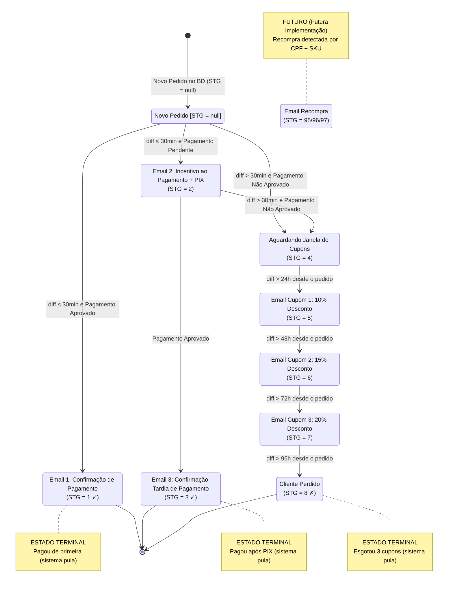
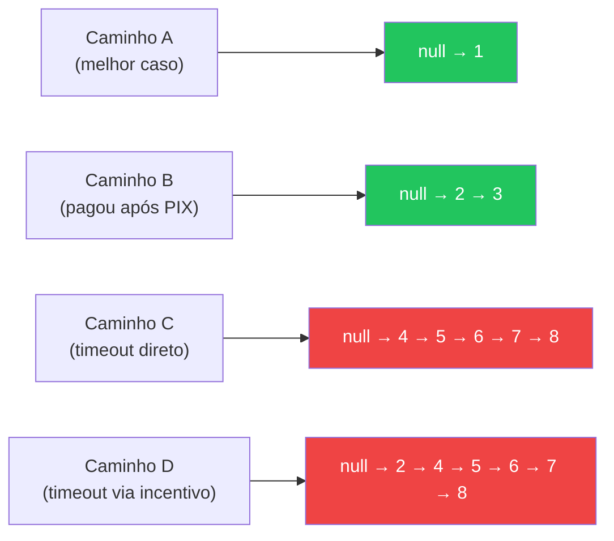

# Diagrama de Estados — STG (Pedidos)

**Data de Criação:** 2026-07-21  
**Referência:** [email_state_machine.md](../../docs/email_state_machine.md)

---

## Legenda

- **Referência temporal**: `diff = now() - data_pedido` (sempre absoluto)
- **Círculos duplos** `[*]`: estados terminais (sistema pula na próxima iteração)
- **Condições entre colchetes**: lógica verificada pelo worker de pedidos
- **Ações entre parênteses**: email enviado e/ou marcação no banco

---

## Diagrama



---

## Tabela Resumo de Transições

| De | Para | Condição Temporal | Condição de Pagamento | Email | Terminal? |
|---|---|---|---|---|---|
| `null` | `1` | `diff ≤ 30min` | Aprovado | Email 1 | ✓ Sim |
| `null` | `2` | `diff ≤ 30min` | Pendente | Email 2 | Não |
| `null` | `4` | `diff > 30min` | Não aprovado | — | Não |
| `2` | `3` | qualquer | Aprovado | Email 3 | ✓ Sim |
| `2` | `4` | `diff > 30min` | Não aprovado | — | Não |
| `4` | `5` | `diff > 24h` | — | Cupom 1 (10%) | Não |
| `5` | `6` | `diff > 48h` | — | Cupom 2 (15%) | Não |
| `6` | `7` | `diff > 72h` | — | Cupom 3 (20%) | Não |
| `7` | `8` | `diff > 96h` | — | — | ✓ Sim |


---

## Caminhos Completos Possíveis



---

## Regra de Entrada do Worker de Pedidos

```
PARA CADA pedido no JSON:
  1. cart_id ← pedido.metadata.cart_id
  2. BUSCAR cart_id na email_status_table
     ├── EXISTE → UPDATE pedido_id, data_pedido, cpf, sku
     └── NÃO EXISTE → INSERT nova linha
  3. LER stg
  4. SE stg ∈ {1, 3, 8, 95, 96, 97} → SKIP
  5. APLICAR transições conforme tabela acima
  6. SE email enviado → sobrescrever timestamp_ultimo_email
  7. COMMIT (dentro de transação FOR UPDATE)
```
